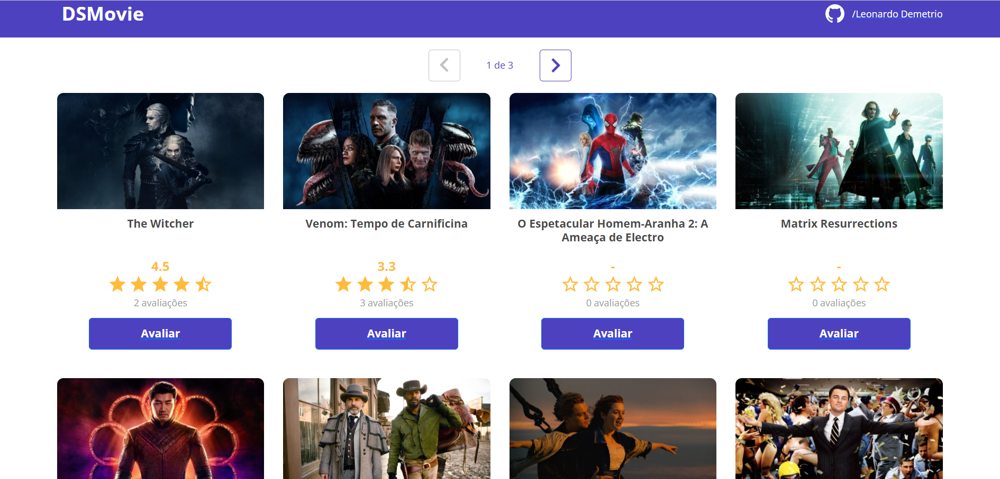

# PROJETO DSMOVIE DA SEMANA SPRING REACT

Tecnologias

*   java 11
*   Spring boot
*   h2
*   PostgreSQL
*   React.JS
*   Typescritp
*   JavaScript
*   HTML
*   Css
*   BootStrap
*   Heroku
*   Netlyfy

---

### Página principal

---

### Página da lista de filmes

### Página de votação

API

Api desenvolvida em Java Spring boot que faz buscas por todos os filmes no banco de dados, quanto por ID. A API, também faz a inserção de 2 tipos de dados, um score e um email para cada filme. 

https://leo-dsmovie.herokuapp.com

GET

    /movies
    /movies/{id}

PUT
    
    /scores
    
    {
    "movieId" : 1,
    "email": "email",
    "score": 5
    }
